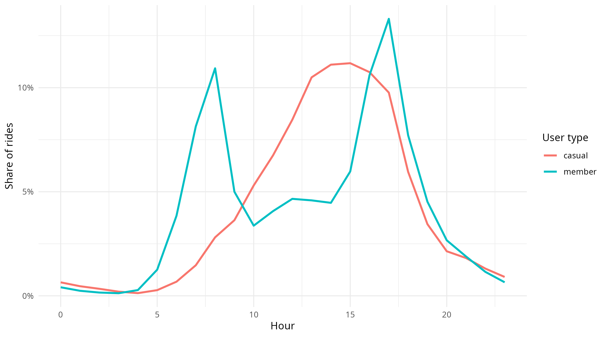
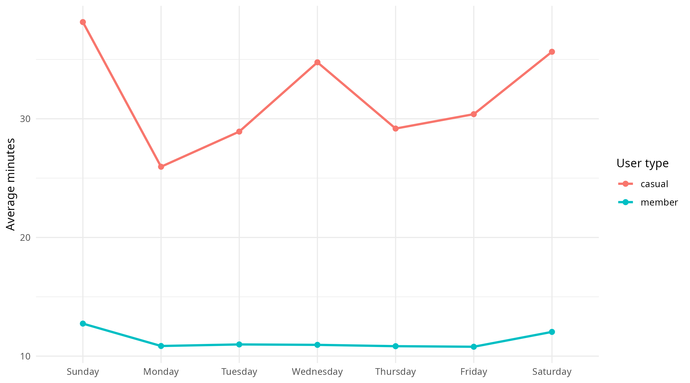

# Divvy Bike Share Behavioral Analysis

Behavioral analysis of ~790K Divvy bike trips (2019–2020) using R (tidyverse) to identify membership conversion opportunities.

---

## Objective
Increase annual membership by analyzing behavioral differences between casual riders and annual members.

---

## Dataset
Public Divvy Bike Share trip data (2019–2020, ~790K records).

---

## Workflow
- **01_data_preparation.R** – Data cleaning & feature engineering  
- **02_analysis.R** – Outlier handling, KPI computation, behavioral analysis & visualization  

---

## Key Findings
- Members show strong weekday and commute-hour usage patterns.
- Casual riders take longer rides concentrated on weekends and midday.
- Ride duration distribution is right-skewed and required outlier handling.
---

## Key Visualizations

### Rides by Hour of Day (Share)

---

## Strategic Recommendation
- Prioritize conversion of weekday-aligned casual riders.
- Introduce flexible, leisure-oriented membership options.

---

## Tools
R (tidyverse, lubridate, ggplot2)
